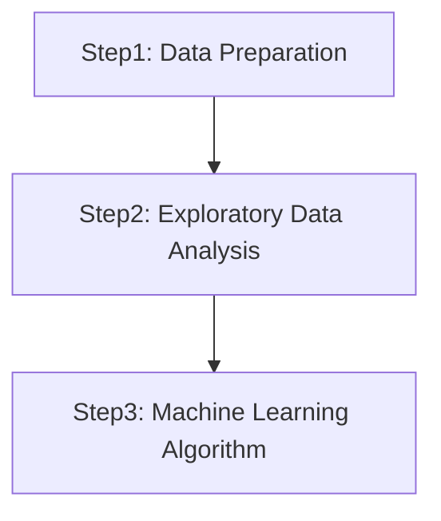
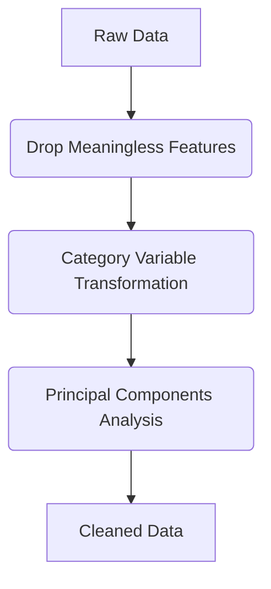
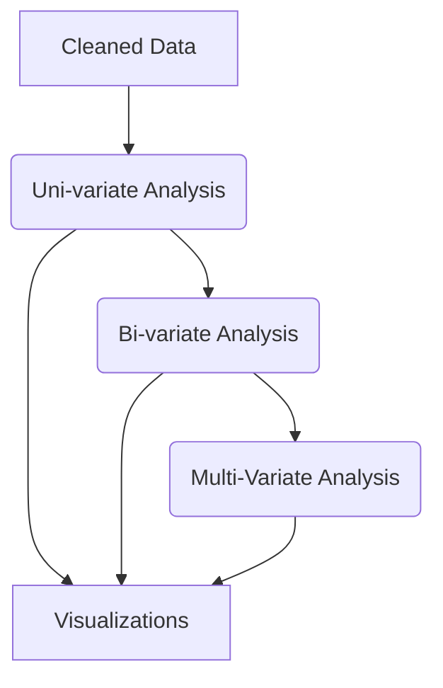
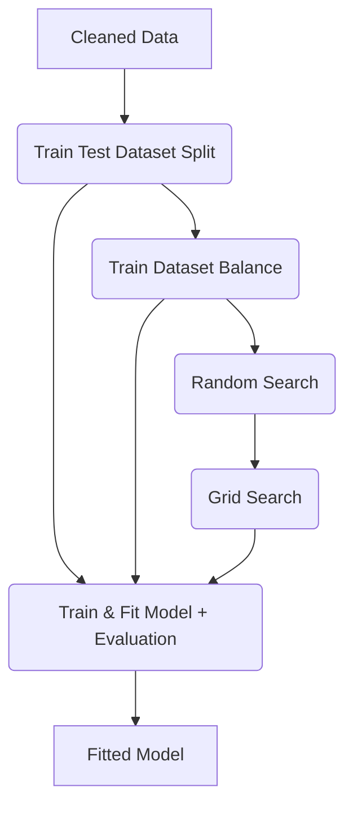

# SC5010_IBM_Data_Analysis

## 1. Environment:
```
pip install numpy  
pip install pandas  
pip install sklearn  
pip install opencv  
pip install seaborn  
pip install os  
pip install matplotlib
pip install imblearn
```  

## 2. Project Objectives:
### 2.1 Dataset Description:
IBM employee data with 35 columns (features) and 1470 rows.
```
https://www.kaggle.com/datasets/pavansubhasht/ibm-hr-analytics-attrition-dataset
```
Data Set : IBM HR Analytics Employee Attrition & Performance
35 Variables & 1470 Rows
- Personal info: Gender, Age, Education, Marital Status, etc.
- Work Experience: Job Level, Num Companies Worked, etc.
- Company Rating: Job Involvement, Daily\Monthly Rating, etc.
- Working Condition: Distance from Home, Business Travel, etc.
- Benefits: Monthly Income, Percent Salary Hike, etc.

### 2.2 Objective Questions:
#### Q1: What factors matter most in their attrition decision?
#### Q2: How to prevent employees from resigning?

## 3. Project Files:

| File Directory                              | File Attribute                            |
| ------------------------------------------- | ----------------------------------------- |
| /data/WA_Fn-UseC_-HR-Employee-Attrition.csv | Raw Data                                  |
| /data/cleaned_data.csv                      | Cleaned Data                              |
| /data/category.csv                          | Category Variables                        |
| /data/numeric.csv                           | Numeric Variables                         |
| /data/pca.csv                               | Principal Components                      |
| /data/category_numeric_pca.csv              | All data type combined together           |
| /DataPreparation.ipynb                      | Pre-process of Dataset                    |
| /EDA.ipynb                                  | Exploratory Data Analysis                 |
| /LogisticRegression.ipynb                   | Logistic Regression Model Fitting Process |
| /RandomForest.ipynb                         | Random Forest Model Fitting Process       |
| /DecisionTree.ipynb                         | Classification Tree Model Fitting Process |
| /SupportVectorMachines.ipynb                | SVM Model Fitting Process                 |
| /XGBoost.ipynb                              | xgboost Model Fitting Process             |

## 4. Project Structure:


### 4.1 Step1: DataPreparation.ipynb

### 4.2 Step2: EDA.ipynb

### 4.3 Step3: LogisticRegression.ipynb / RandomForest.ipynb / DecisionTree.ipynb / SupportVectorMachines.ipynb / XGBoost.ipynb


## 5. Results:
Summary of the models' performance

|           | Logistic<br>Regression | SVM   | Decision<br>Tree | Random<br>Forest | XGBoost |
| --------- | ---------------------- | ----- | ---------------- | ---------------- | ------- |
| Accuracy  | 0.864                  | 0.847 | 0.765            | 0.864            | 0.830   |
| Precision | 0.548                  | 0.600 | 0.288            | 0.654            | 0.429   |
| F1-score  | 0.535                  | 0.118 | 0.355            | 0.459            | 0.265   |
| Recall    | 0.523                  | 0.065 | 0.463            | 0.354            | 0.191   |

## 6. Conclusion:
#### Q1: What factors matter most in their attrition decision?

-Less working years would usually result in low MonthlyIncome, which is one of the main factors cause people to resign.  
-Higher OverTime working hours result in resignation

Main Factors:  
>Low MonthlyIncome  
>Younger Group  
>OverTime  
...

#### Q2: How to prevent employees from resigning?

-Reduce the OverTime working hours / Increase the OverTime extra salary  
-Provide better welfare for young employee:  
>Stock Option Level  
>MonthlyIncome  
...
